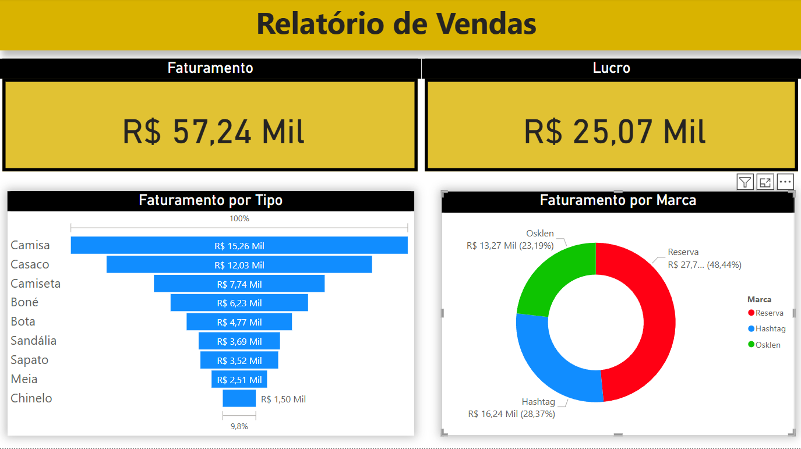

# 📊 Dashboard de Vendas  

Este repositório contém um dashboard interativo de vendas desenvolvido no Power BI.  

## 🖼️ Visualização do Dashboard  
  

## 📂 Arquivos do Repositório  
- `Dash_vendas.pbix` → Arquivo do Power BI com os gráficos interativos  
- `Base Vendas.xlsx` → Base de dados utilizada no dashboard  
- `README.md` → Informações sobre o projeto  

## 🚀 Como Abrir o Dashboard  
1. Baixe o arquivo `Dash_vendas.pbix`  
2. Abra no **Power BI Desktop**  
3. Explore os gráficos interativos clicando nas visualizações  

## 🔗 Como Tornar o Dashboard Interativo Online?  
Se quiser compartilhar o dashboard para que outras pessoas possam interagir, siga estes passos:  
1. Publique no **Power BI Service**  
2. Vá até **"Arquivo" > "Publicar na Web"**  
3. Copie o link gerado e compartilhe aqui no repositório  

💡 **Dica:** Você pode integrar o Power BI com uma página web para tornar o dashboard acessível diretamente pelo navegador.  

📌 **Criado por:** [José Wesley](https://github.com/wesjoley)  
